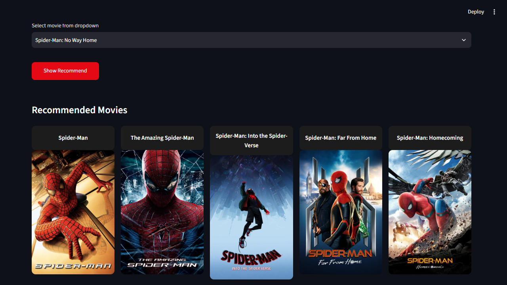

# 🎬 Movie Recommendation System

A **Content-Based Filtering** movie recommendation system that uses cosine similarity between movies to suggest titles with content/genres similar to the one selected by the user. The app is built with **Streamlit**, providing a simple and interactive web interface.

## 🖼️ Demo



The user selects a movie from the dropdown → clicks **Show Recommend** → the system displays a list of similar movies along with their posters.

## 📌 Features

- Search and select a movie from the available list
- Recommend similar movies based on content (overview, genres, cast, director...)
- Intuitive web interface, easy to use thanks to Streamlit
- Custom-styled interface using CSS

## 🗂️ Project Structure

```
Movie-Recommendation-System/
├── .streamlit/
│   └── secrets.toml          # Stores API keys / sensitive info (not committed to Git)
├── assets/
│   └── style.css             # Custom CSS for the Streamlit interface
├── dataset/
│   └── movies.csv            # Raw dataset containing movie information
├── notebooks/
│   └── experiment.ipynb      # Notebook for experimentation, data processing, and model building
├── src/
│   └── recommender.py        # Core logic for movie recommendations
├── app.py                    # Main file to run the Streamlit app
├── movies_list.pkl           # Processed movie list (pickle)
├── similarity.pkl            # Similarity matrix between movies (pickle)
├── .gitignore
└── README.md
```

## ⚙️ Installation

### 1. Clone the repository

```bash
git clone https://github.com/chinh1809z/Movie-Recommendation-System.git
cd Movie-Recommendation-System
```

### 2. Create a virtual environment (recommended)

```bash
python -m venv .venv
# Windows
.venv\Scripts\activate
# macOS/Linux
source .venv/bin/activate
```

### 3. Install the required libraries

```bash
pip install -r requirements.txt
```

## 🔑 Configuration

If the app calls an external API (e.g. the TMDB API to fetch movie posters), create a `.streamlit/secrets.toml` file with the following content:

```toml
TMDB_API_KEY = "your_api_key_here"
```

## ▶️ Running the App

```bash
streamlit run app.py
```

Once running, the app will open at `http://localhost:8501`.

## 🧠 How It Works

1. **Data preprocessing** (`notebooks/experiment.ipynb`): Data from `dataset/movies.csv` is cleaned, features are extracted (genres, keywords, cast, director, overview...) and converted into vectors.
2. **Similarity computation**: **Cosine Similarity** is used to compute the similarity between movies, and the results are stored in `similarity.pkl`.
3. **Movie recommendation** (`src/recommender.py`): When the user selects a movie, the system looks up the similarity matrix and returns the top most similar movies.
4. **Interface** (`app.py`): Displays the movie list, lets the user pick a movie, and shows the recommendation results visually.

## 📊 Dataset

The `dataset/movies.csv` file contains movie information used to train the recommendation model (e.g. title, genres, overview, cast, director...).

## 🛠️ Tech Stack

- **Python**
- **Streamlit** – for building the web interface
- **Pandas** – for data processing
- **Scikit-learn** – for computing similarity (Cosine Similarity)
- **Pickle** – for storing the trained model

## ⚠️ Troubleshooting

### Movie posters not showing / errors when calling the TMDB API

In some regions or with certain ISPs, TMDB domains (`api.themoviedb.org`, `image.tmdb.org`) may be blocked, causing the app to fail to fetch posters or throw timeout/connection errors when calling the API.

**How to fix:**
- Turn on a **VPN** (switch to a server in a different country) and rerun the app
- Alternatively, changing your DNS (e.g. to `1.1.1.1` or `8.8.8.8`) can help in some cases
- If deploying on a server/cloud provider, check whether their firewall/network blocks outbound requests to TMDB

> This is a network/provider-side limitation, not a bug in the app's code.

## 🚀 Roadmap

- Add movie posters via the TMDB API
- Add recommendations based on user ratings (Collaborative Filtering)
- Deploy the app to Streamlit Cloud / Render / Heroku
- Add advanced search and filtering by genre/release year

## 🙋‍♂️ Author

- Phạm Trung Chính – [GitHub](https://github.com/chinh1809z)
